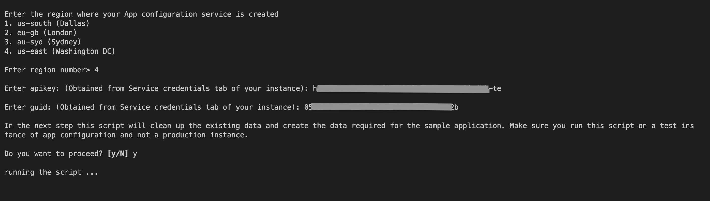
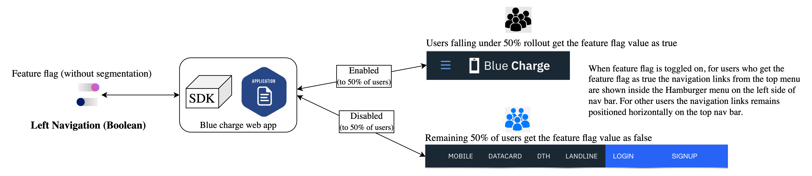

# Golang Sample Application for IBM Cloud App Configuration service

**DISCLAIMER**: This is a guideline sample application and is used for demonstrative and illustrative purposes only.
This is not a production ready code.

This sample contains a Golang microservice that you can use to learn more about the IBM Cloud App Configuration service.

## Contents

- [Golang Sample Application for IBM Cloud App Configuration service](#golang-sample-application-for-ibm-cloud-app-configuration-service)
  - [Contents](#contents)
  - [Prerequisite](#prerequisite)
  - [Create an instance of App Configuration service](#create-an-instance-of-app-configuration-service)
  - [Setup the App Configuration service instance](#setup-the-app-configuration-service-instance)
  - [Run the sample](#run-the-sample)
- [Explore the app and its use cases](#explore-the-app-and-its-use-cases)
  - [Use case 1](#use-case-1)
  - [Use case 2](#use-case-2)
  - [Use case 3](#use-case-3)
- [License](#license)

## Prerequisite

- You need an [IBM Cloud](http://cloud.ibm.com/) account. If you don't have an account, create
  one [here](https://cloud.ibm.com/registration/).

## Create an instance of App Configuration service

- Log in to your IBM Cloud account.
- In the [IBM Cloud catalog](https://cloud.ibm.com/catalog#services), search **App Configuration** and
  click [App Configuration](https://cloud.ibm.com/catalog/services/app-configuration). The service provisioning page
  opens.
- **Select a region** - Currently, Dallas (us-south), London (eu-gb) and Sydney (au-syd) regions are supported.
- Select a pricing plan, resource group and configure your resource with a service name, or use the preset name.
- Click **Create**. A new service instance is created and the App Configuration dashboard is displayed.

## Setup the App Configuration service instance

- Download the source code
    ```
    git clone https://github.com/IBM/appconfiguration-samples.git
    cd appconfiguration-samples/golang
    ```
- Install `jq` - command-line JSON processor.
    - You can install it from [here](https://stedolan.github.io/jq/download/)
- Go to dashboard of your App Configuration instance in IBM Cloud UI.
- Navigate to Service Credentials section and generate a new set of credentials. Note down the `region`, `guid`
  and `apikey`. These credentials are required in the next steps.
- From your terminal, execute the [`demo.sh`](../common/script/demo.sh) script by running below command
    ```bash
    $ cd appconfiguration-samples/common/script
    $ ./demo.sh
    ```
  > If you face any permission errors during the script execution, provide appropriate permission to the file by running - `chmod +x ./demo.sh`. And then execute the script.
- Provide all the inputs during script execution. A sample example is shown in below figure
  
- Script execution takes time. Script is executed successfully only when you see the log `---Demo script complete---` at
  the end in your terminal.
- This script will create the collections, feature flags, properties & segments using the default dev environment in the
  instance which are required for the sample(Bluecharge) web app.

## Run the sample

- Prerequisites
    - Golang installed on your machine.
- Provide all the configuration values in [`.env`](.env) file
- Run `go build` from the root folder to generate an executable binary for our sample Go application
- Run `./golang` to start the app
- Access the running app in a browser at http://localhost:3000 (Can change the port in the .env file)

**Note**: Steps are provided to run the app on Kubernetes.

- [Using minikibe](../common/minikube)
- [On IKS(IBM Kubernetes Service)](../common/kube)

# Explore the app and its use cases

Keep the app running. Login with different email ids at a time.

## Use case 1



## Use case 2


## Use case 3


# License

This project is released under the Apache 2.0 license. The license's full text can be found in [LICENSE](LICENSE)

See [here](https://cloud.ibm.com/docs/app-configuration) for detailed docs on App Configuration service.
