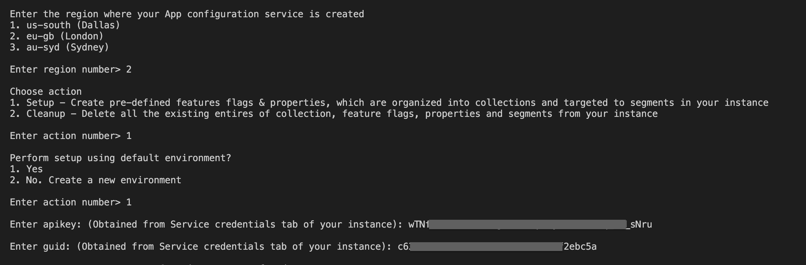
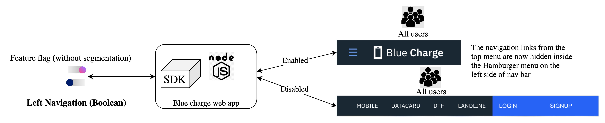
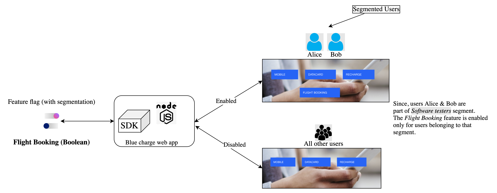
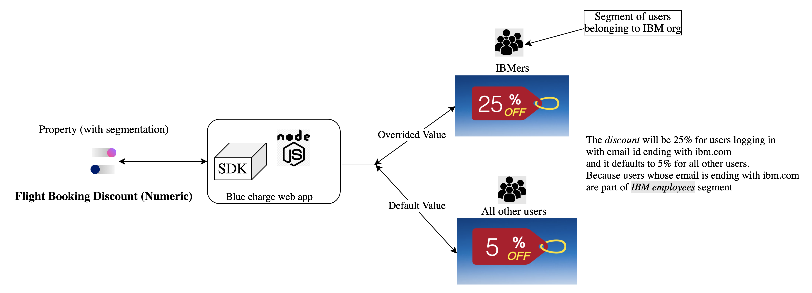

# Node.js Sample Application for IBM Cloud App Configuration service
> **DISCLAIMER**: This is a guideline sample application and is used for demonstrative and illustrative purposes only. This is not a production ready code.

This sample contains an Node.js microservice that you can use to learn more about the IBM Cloud App Configuration service.

## Contents
- [Node.js Sample Application for IBM Cloud App Configuration service](#nodejs-sample-application-for-ibm-cloud-app-configuration-service)
  - [Contents](#contents)
  - [Prerequisite](#prerequisite)
  - [Create an instance of App Configuration service](#create-an-instance-of-app-configuration-service)
  - [Setup the App Configuration service instance](#setup-the-app-configuration-service-instance)
  - [Run the sample](#run-the-sample)
- [Explore the app and its use cases](#explore-the-app-and-its-use-cases)
  - [Use case 1](#use-case-1)
  - [Use case 2](#use-case-2)
  - [Use case 3](#use-case-3)
- [License](#license)

## Prerequisite

- You need an [IBM Cloud](http://cloud.ibm.com/) account. If you don't have an account, create one [here](https://cloud.ibm.com/registration/).

## Create an instance of App Configuration service
- Log in to your IBM Cloud account.
- In the [IBM Cloud catalog](https://cloud.ibm.com/catalog#services), search **App Configuration** and click [App Configuration](https://cloud.ibm.com/catalog/services/app-configuration). The service provisioning page opens.
- **Select a region** - Currently, Dallas (us-south), London (eu-gb) and Sydney (au-syd) regions are supported.
- Select a pricing plan, resource group and configure your resource with a service name, or use the preset name.
- Click **Create**. A new service instance is created and the App Configuration dashboard is displayed.

## Setup the App Configuration service instance
- Download the source code
    ```
    git clone https://github.com/IBM/appconfiguration-samples.git
    cd appconfiguration-samples/nodejs
    ```
- Install `jq` - command-line JSON processor.
    - You can install it from [here](https://stedolan.github.io/jq/download/)
- Go to dashboard of your App Configuration instance in IBM Cloud UI.
- Navigate to Service Credentials section and generate a new set of credentials. Note down the `region`, `guid` and `apikey`. These credentials are required in the next steps.
- From your terminal, inside the source code execute the `demo.sh` script by running below command
    ```bash
    $ ./demo.sh
    ```
    > If you face any permission errors during the script execution, provide appropriate permission to the file by running - `sudo chmod 777 ./demo.sh`. And then execute the script.  
- Provide all the inputs during script execution. A sample example is shown in below figure
  
- Script execution takes time. Script is executed successfully only when you see the log `---Demo script complete---` at the end in your terminal.
- This script will create the collections, feature flags, properties & segments using the default dev environment in the instance which are required for the sample(Bluecharge) web app.

## Run the sample
- Prerequisites
    - Node.js installed on your machine.
    - MongoDB Community Edition installed on your machine. Official installation links for [Windows](https://docs.mongodb.com/manual/tutorial/install-mongodb-on-windows/), [Linux](https://docs.mongodb.com/manual/administration/install-on-linux/) & [macOS](https://docs.mongodb.com/manual/tutorial/install-mongodb-on-os-x/). External installation links for [Windows](https://medium.com/@LondonAppBrewery/how-to-download-install-mongodb-on-windows-4ee4b3493514), [Linux](https://www.digitalocean.com/community/tutorials/how-to-install-mongodb-on-ubuntu-18-04) & [macOS](https://zellwk.com/blog/install-mongodb/).
- Provide the configuration values in file [`app.js`](app.js)

    1. Provide `region`, `guid` & `apikey` at [line 31](app.js#L31) with the values you obtained from the Service credentials section of the instance. And `collectionId` as `blue-charge` & `environmentId`(default value is `dev` ) at [line 39](app.js#L39) and start the app with `npm start`. Alternatively, you can pass all these values as env variables from the command line and start the app.
        ```bash
        $ REGION=<region> GUID=<guid> APIKEY=<apikey> COLLECTION_ID=blue-charge ENVIRONMENT_ID=dev npm start
        ```
    2. For Mongo database connection. Follow the instruction given in the file at [line 51](app.js#L51). Make sure you comment either of url, options before running the app locally or on Kubernetes using minikube or on IKS(IBM Kubernetes Service).
- Make sure your local mongo db is running or start the mongo server by running `mongod start` from the path where it is installed.
- Installing Dependencies
    - Run `npm install` from the root folder to install the app’s dependencies.
- Run `npm start` to start the app
- Access the running app in a browser at http://localhost:3000

**Note**: Steps are provided to run the app on Kubernetes.
 - [Using minikibe](minikube)
 - [On IKS(IBM Kubernetes Service)](kube)

# Explore the app and its use cases
Keep the app running. Signup and create various users with different email ids. Additionally, signup/create two users with email id `alice@bluecharge.com` & `bob@bluecharge.com`


## Use case 1


## Use case 2


## Use case 3



# License
This project is released under the Apache 2.0 license. The license's full text can be found in [LICENSE](LICENSE)

See [here](https://cloud.ibm.com/docs/app-configuration) for detailed docs on App Configuration service.
