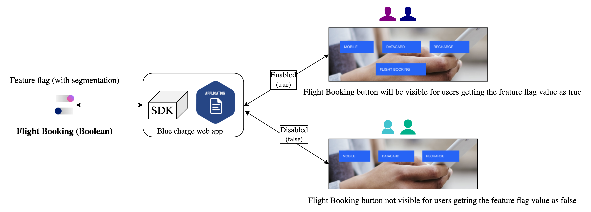
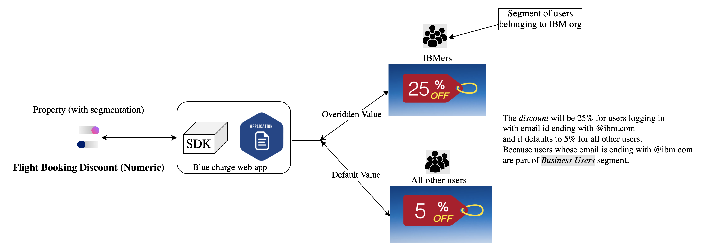

# Python Sample Application for IBM Cloud App Configuration service
> **DISCLAIMER**: This is a guideline sample application and is used for demonstrative and illustrative purposes only. This is not a production ready code.

This sample contains a Python microservice that you can use to learn more about the IBM Cloud App Configuration service.

## Contents
- [Python Sample Application for IBM Cloud App Configuration service](#python-sample-application-for-ibm-cloud-app-configuration-service)
  - [Contents](#contents)
  - [Prerequisite](#prerequisite)
  - [Create an instance of App Configuration service](#create-an-instance-of-app-configuration-service)
  - [Setup the App Configuration service instance](#setup-the-app-configuration-service-instance)
  - [Run the sample](#run-the-sample)
- [Explore the app and its use cases](#explore-the-app-and-its-use-cases)
  - [Use case 1: Canary release](#use-case-1-canary-release)
  - [Use case 2: Dark launch in a phased manner](#use-case-2-dark-launch-in-a-phased-manner)
  - [Use case 3: Properties](#use-case-3-properties)
- [License](#license)

## Prerequisite

- You need an [IBM Cloud](http://cloud.ibm.com/) account. If you don't have an account, create one [here](https://cloud.ibm.com/registration/).

## Create an instance of App Configuration service
- Log in to your IBM Cloud account.
- In the [IBM Cloud catalog](https://cloud.ibm.com/catalog#services), search **App Configuration** and click [App Configuration](https://cloud.ibm.com/catalog/services/app-configuration). The service provisioning page opens.
- **Select a region** - Currently, Dallas (us-south), London (eu-gb), Sydney (au-syd) and Washington DC (us-east) regions are supported.
- Select a pricing plan, resource group and configure your resource with a service name, or use the preset name.
- Click **Create**. A new service instance is created and the App Configuration dashboard is displayed.

## Setup the App Configuration service instance
- Download the source code
    ```
    git clone https://github.com/IBM/appconfiguration-samples.git
    cd appconfiguration-samples/python
    ```
- Install `jq` - command-line JSON processor.
    - You can install it from [here](https://stedolan.github.io/jq/download/)
- Go to dashboard of your App Configuration instance in IBM Cloud UI.
- Navigate to Service Credentials section and generate a new set of credentials. Note down the `region`, `guid` and `apikey`. These credentials are required in the next steps.
- From your terminal, inside the source code execute the `demo.sh` script by running below command
    ```bash
    $ cd appconfiguration-samples/common/script
    $ ./demo.sh
    ```
    > If you face any permission errors during the script execution, provide appropriate permission to the file by running - `chmod +x ./demo.sh`. And then execute the script.  
- Provide all the inputs during script execution. A sample example is shown in below figure
  
- Script execution takes time. Script is executed successfully only when you see the log `---script run complete---` at the end of your terminal.
- This script will create the collections, feature flags, properties & segments using the default dev environment in the instance which are required for the sample(Bluecharge) web app.

## Run the sample
This section states the steps to install the pre requisite software/modules to be installed. A shell file has been provided which contains the commands to install all the necessary software to run the main application.
- Prerequisites to be installed/upgraded:
    - Open the terminal
    - Run ` sudo su ` to become root user
    - Run the dependencies.sh shell file by executing the below command
        ```bash
        $ cd appconfiguration-samples/python
        $ ./dependencies.sh
        ```
    - Answer the Yes/No Prompt as required if any
    - Once all the dependencies are installed, the main application can be run
- Provide all the configuration values in [`.env`](./config/.env) file in config folder
    - Paste the REGION, GUID and APIKEY values generated from the service credentials section of the App Configuration service instance.
- Run `python app.py` to start the app
- Access the running app in a browser at http://localhost:3000 (You can change the port in the .env file)

# Explore the app and its use cases
Keep the app running. Login with different email ids at a time.

## Use case 1: Canary release

Keep the default rollout percentage to 50% and turn on the toggle for `Left Navigation` feature flag. Login on the sample app with email id say, `jack@ibm.com` you would see the navigation links on the top get positioned to left side inside the hamburger menu. If you signout and login with email `james@ibm.com` you will see the old UI. This is because user `jack` falls under the 50% rollout and user `james` doesn't. Now increase the rollout percentage to 75% and both the users will be seeing the hamburger menu. This is how you can do a canary release by first rolling out the change to a small subset of users before gradually rolling it out to the entire infrastructure and making it available to everybody(100%).


## Use case 2: Dark launch in a phased manner

Keep the default rollout percentage to 0% and turn on the toggle for `Flight Booking` feature flag. Login with email id `alice@bluecharge.com` and you would see flight booking button displayed on the home screen banner. This is because for all the user emails ending with `@bluecharge.com` the feature flag is set to be enabled as per it's targeting rules. You then rollout this feature to a new group called `Business Users` by increasing the rollout percentage of this group from 0 to 50% in the Edit targeting screen. Which mean 50% of the user emails belonging to this group will also see the flight booking button. Next you can increase the default rollout percentage from 0 to 100% and make the flight booking button available to all users.


## Use case 3: Properties

Segmentation applied to properties.


# License
This project is released under the Apache 2.0 license. The license's full text can be found in [LICENSE](LICENSE)

See [here](https://cloud.ibm.com/docs/app-configuration) for detailed docs on App Configuration service.
